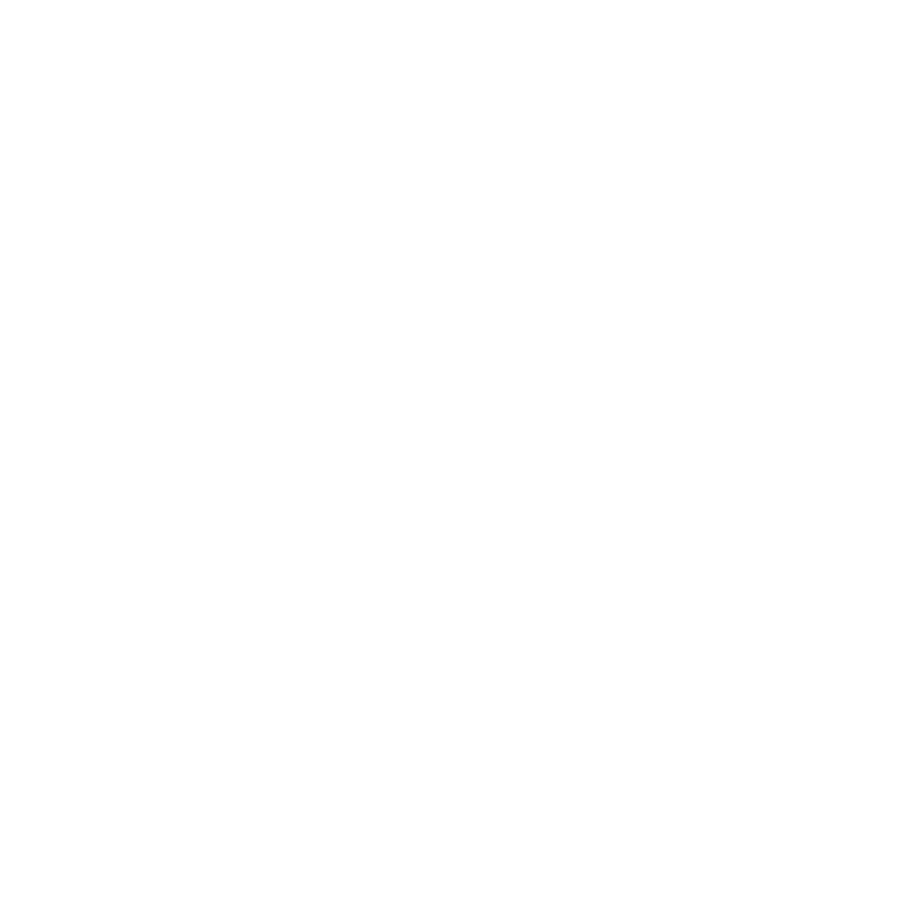

<p align="center">
  
</p>

<h1 align="center">Tray Voice Notes</h1>

<p align="center">
  Right-click your tray icon, talk, right-click again. Your note is recorded, transcribed on your PC, and waiting in a flyout.
</p>

Tray Voice Notes is a small, tray-only Windows app for capturing quick thoughts by voice. There is no main window and nothing to open first. Recording starts with one right-click on the notification-area icon. Transcription runs locally with [Whisper](https://github.com/ggerganov/whisper.cpp), so your audio never leaves your machine.

Built with WinUI 3, the Windows App SDK and .NET 10.

## Features

- **One-gesture recording.** Right-click the tray icon to start and right-click again to stop. The icon turns red while recording and has its own look when paused.
- **Local transcription.** [Whisper.net](https://github.com/sandrohanea/whisper.net) runs on-device. The chosen model is downloaded the first time you need it and released from memory as soon as the transcription queue is empty.
- **Waveforms and playback.** Every recording in the flyout shows a waveform. You can play it back and seek by clicking the waveform.
- **Editable notes.** Open a recording to correct the transcript, add your own notes, copy the transcript, or delete the recording.
- **Pause and resume.** Pausing closes the microphone, so the Windows microphone indicator goes away. Resuming appends to the same file.
- **Configurable right-click.** Choose whether right-click records or opens the menu, and whether right-clicking during a recording stops it or pauses and resumes it. **Shift+right-click always opens the menu**, so Settings and Exit stay one gesture away.
- **Light on resources.** The app does no background network work. The only network use is downloading a model on demand. Release builds use no background GC thread, Windows NLS instead of ICU, and ReadyToRun plus trimming.

## How it works

| Step | What happens |
|---|---|
| Record | NAudio captures the microphone straight to a 16 kHz, mono, 16-bit WAV. This is the format Whisper takes, so nothing is converted later. |
| Queue | When you stop, the note is queued. Notes are transcribed one at a time, in order. |
| Transcribe | The ggml model is loaded for the batch, each note is transcribed, then the model is released. |
| Browse | The flyout lists notes newest first. Peaks for the waveforms are computed once and stored in a small JSON index. |

### Where your data lives

Everything is stored in the app's package `LocalFolder`:

- `Recordings\<id>.wav` holds the audio.
- `Recordings\notes.json` holds the index of transcripts, your notes and waveform peaks.
- `Models\ggml-<name>.bin` holds the downloaded Whisper models.

### Whisper models

Pick a model in **Settings → Transcription**. Bigger models are more accurate but slower and heavier.

| Model | Languages | Download |
|---|---|---|
| Tiny | English | ~75 MB |
| **Base** (default) | English | ~142 MB |
| Small | English | ~466 MB |
| Tiny / Base / Small | Multilingual | ~75 / 142 / 466 MB |
| Large v3 Turbo (q5_0) | Multilingual | ~547 MB |

Models are fetched from the [whisper.cpp repository on Hugging Face](https://huggingface.co/ggerganov/whisper.cpp) the first time they are needed. That download is the only network request the app makes.

## Using it

| Gesture | Result |
|---|---|
| Left-click the tray icon | Open the flyout with your recordings |
| Right-click (idle) | Start recording (or open the menu, depending on your setting) |
| Right-click (recording) | Stop, or pause and resume, depending on your setting |
| Shift+right-click | Always open the menu (Settings, Exit) |

**Settings** are in the flyout and cover:

- What right-click does while idle and while recording.
- Which microphone to use.
- Which Whisper model to use.
- Start with Windows.

## Requirements

- Windows 10 version 1809 (build 17763) or later. Windows 11 is recommended.
- x64 or ARM64.
- A microphone.
- For development: the [.NET 10 SDK](https://dotnet.microsoft.com/download), Windows 11 SDK 10.0.26100, and Developer Mode turned on.

## Build and run

The app is MSIX-packaged and needs package identity. `dotnet run` registers a loose-layout package through the [`winapp` CLI](https://github.com/microsoft/WinAppCli) and launches it for you.

```powershell
# Run with package identity (recommended)
dotnet run -c Debug -p:Platform=x64        # use ARM64 on Arm machines

# Build only
dotnet build -c Debug -p:Platform=x64

# Test first-run behavior: wipe LocalState and settings
winapp run .\bin\x64\Debug\net10.0-windows10.0.26100.0 --clean

# Remove the dev registration
winapp unregister
```

Every `dotnet build` and `dotnet test` needs `-c` and `-p:Platform=`. To detect the platform on this machine:

```powershell
$Platform = if ($env:PROCESSOR_ARCHITECTURE -eq 'AMD64') { 'x64' } else { $env:PROCESSOR_ARCHITECTURE }
```

### Tests

The decision logic (click policy, waveform math, text formatting) has no WinRT dependency. A plain `net10.0` xUnit project covers it by linking the source files in directly.

```powershell
dotnet test .\tests\TrayVoiceNotes.Tests -c Debug
```

### Releasing

`build-msix-for-gh.ps1` builds a signed MSIX, tags the repo and publishes a GitHub release. Signing is done by a local `sign-msix` function on the maintainer's machine, so no signing configuration lives in the repo. Use `-SkipRelease` to build and sign only.

## Project layout

```
App.xaml.cs            Tray icon, single instance, click handling, the only exit path
Views/                 Flyout window, flyout list, note detail page, settings page
Controls/              WaveformView
Models/                VoiceNote
Services/              Recording, playback, transcription, models, note store,
                       settings, and the pure-logic helpers
tests/                 xUnit tests for the pure-logic helpers
tools/                 New-StatusIcons.ps1 (generates the recording/paused tray icons)
branding/              Source SVG icons
```

Design rules worth knowing before you change something:

- **No main window.** `App.xaml.cs` owns the tray icon, and the Exit menu item is the only way out.
- **The flyout cleans up after itself.** It is hidden on dismiss and closed after a minute hidden. Anything it starts must stop in `FlyoutPage.OnHidden` or `Dispose`.
- **Network work only while visible**, apart from the on-demand model download.
- **Pure logic stays WinRT-free** so the test project can link it.

## Privacy

- Audio is recorded and transcribed on your device and stays in the app's local folder.
- There is no account, telemetry or cloud transcription.
- The app has the `microphone` and `internetClient` capabilities. The microphone is for recording, and the internet is used only to download Whisper models.

## Built with

- [Windows App SDK](https://learn.microsoft.com/windows/apps/windows-app-sdk/) and WinUI 3
- [WinUIEx](https://github.com/dotMorten/WinUIEx)
- [NAudio](https://github.com/naudio/NAudio) for capture, playback and waveforms
- [Whisper.net](https://github.com/sandrohanea/whisper.net) and [whisper.cpp](https://github.com/ggerganov/whisper.cpp) for transcription
- [winapp CLI](https://github.com/microsoft/WinAppCli) for packaging and the dev loop

## License

[MIT](LICENSE) © 2026 Joseph Finney
